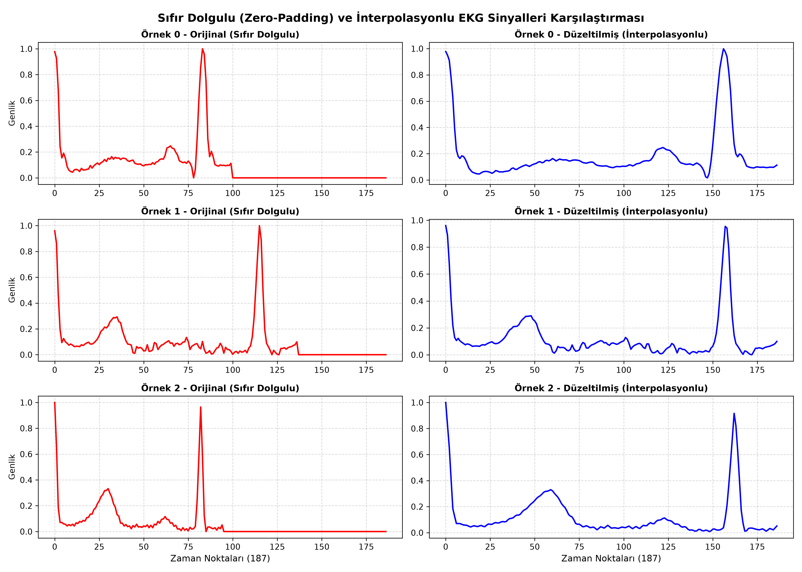
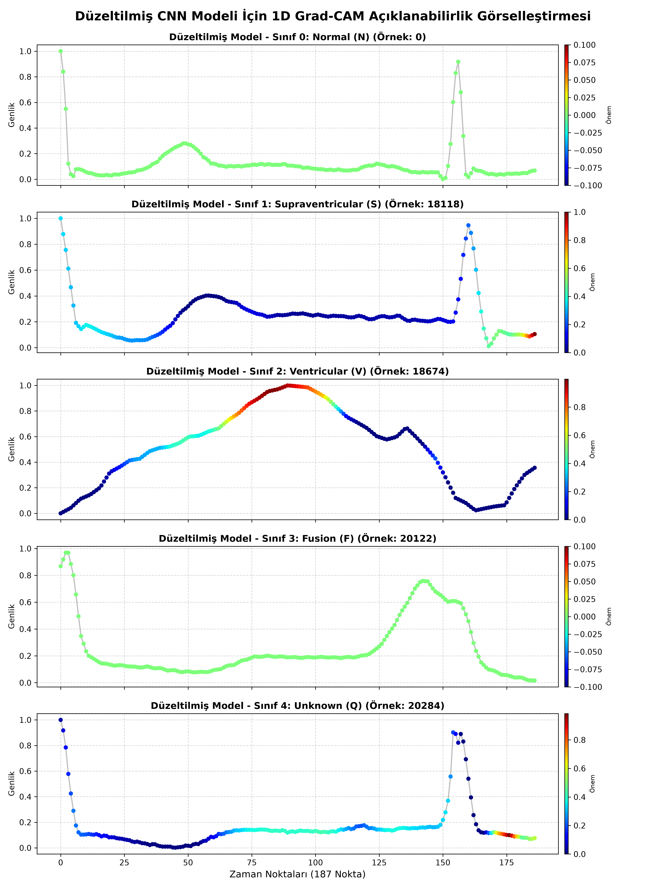
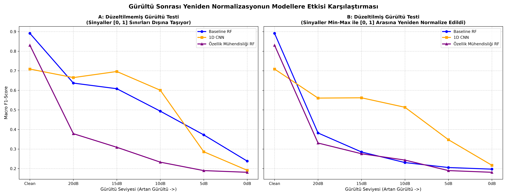

# EKG Sinyali ile Kalp Aritmisi Teşhisi ve Sınıflandırma
## Yapay Zeka, Sinyal İşleme ve Açıklanabilir AI (XAI) Tabanlı Aritmi Teşhis Sistemi

Bu proje, **MIT-BIH Aritmi Veri Tabanı** EKG zaman serisi sinyallerini kullanarak kardiyak anomalileri yüksek doğrulukla sınıflandırmak amacıyla geliştirilmiş uçtan uca bir makine öğrenmesi ve derin öğrenme sistemidir. 

Proje kapsamında geleneksel makine öğrenmesi modelleri, sinyal işleme tabanlı gelişmiş özellik mühendisliği (Öznitelik Çıkarımı) ve derin 1D Evrişimli Sinir Ağları (1D CNN) kurulmuş; modeller açıklanabilir yapay zeka (**1D Grad-CAM**) ve parazit simülasyonları ile klinik şartlarda doğrulanmıştır.

---

## 🚀 Öne Çıkan Özellikler

* **Çoklu Sınıflandırma Mimarisi:** Ağırlık Dengeli Random Forest, SMOTE Dengeli Random Forest, 1D CNN ve Özellik Mühendisliği tabanlı Random Forest modelleri.
* **Sinyal İşleme Tabanlı Özellik Çıkarımı:** Zaman alanı istatistikleri, Fast Fourier Transform (FFT) bant güçleri ve Daubechies 4 (`db4`) Dalgacık Dönüşümü (Wavelet) katsayı enerjileri.
* **Gürültü ve Parazit Simülasyonu (V2 Robustness):** Gaussian beyaz paraziti ve solunum kaynaklı Baseline Wander (0.5 Hz sinüs kayması) altında per-sample normalizasyon testleri.
* **Açıklanabilir Yapay Zeka (XAI - 1D Grad-CAM):** Modelin kararlarını hangi EKG dalga bölgelerine (örneğin QRS kompleksi) dayandırdığının gradyan takibi ile görselleştirilmesi.
* **Metodolojik Düzeltme (Shortcut Learning Fix):** Modelin zero-padding (sıfır dolgusu) artefaktını sömürmesini engelleyen ve modeli morfoloji öğrenmeye zorlayan lineer enterpolasyon ön-işleme hattı.

---

## 📊 Karşılaştırmalı Performans Tablosu

Tüm modellerin test veri kümesi üzerindeki makro performans sonuçları:

| Model | Genel Doğruluk (Accuracy) | Macro F1-Score | Sınıf 1 (S) F1 | Sınıf 3 (F) F1 | Eğitim Süresi |
| :--- | :---: | :---: | :---: | :---: | :---: |
| **Baseline RF (Raw)** | %97.72 | %89.11 | %79 | %77 | 19.68 sn |
| **SMOTE RF (Raw)** | %98.06 | %90.07 | %81 | %77 | 106.20 sn |
| **1D CNN (Orijinal)** | %98.32 | %90.84 | %83 | %77 | 1424.05 sn |
| **Düzeltilmiş CNN (İnterpolasyonlu)** | **%98.10** | **%90.53** | **%83** | **%78** | 1585.99 sn |
| **Özellik Mühendisliği RF** | %95.82 | %83.04 | %67 | %69 | **2.69 sn** |

---

## 📁 Proje Dosya Yapısı

* **`download_data.py`**: Kaggle üzerinden MIT-BIH veri kümesini indiren betik.
* **`explore.py`**: Veri boyutu, sınıf dağılımı ve EKG dalga örneklerini analiz eden betik.
* **`baseline_model.py`**: Ham veri üzerinde karar sınırları dengelenmiş Random Forest modelini eğiten betik.
* **`smote_model.py`**: Sadece eğitim verisine SMOTE uygulayarak veri dengesizliğini gideren RF betiği.
* **`cnn_model.py`**: Evrişimli Sinir Ağını (1D CNN) SMOTE'lu ham veri üzerinde eğiten derin öğrenme betiği.
* **`feature_extraction.py`**: Zaman alanı, FFT ve Wavelet özniteliklerini çıkarıp modeli eğiten betik.
* **`visualize_noise.py`**: SNR=5dB parazit altındaki sınır taşmalarını test eden betik.
* **`noise_robustness_test.py`**: Modellerin gürültülü test setlerindeki (20dB-0dB) dayanıklılığını ölçen betik.
* **`feature_ablation_study.py`**: 8 farklı özellik kombinasyonunun etkisini analiz eden betik.
* **`gradcam_explainability.py`**: Orijinal model için 1D Grad-CAM ısı haritasını oluşturan XAI betiği.
* **`fix_padding.py`**: Sıfır dolgularını kaldırıp sinyalleri enterpole eden ve CNN modelini eğiten betik.
* **`gradcam_fixed.py`**: Düzeltilmiş modelin gerçek biyolojik dalgalara odaklandığını kanıtlayan Grad-CAM betiği.
* **`final_report.md`**: Akademik ve metodolojik detayları içeren kapsamlı proje final raporu.
* **`walkthrough.md`**: Proje adımlarını özetleyen teknik kılavuz.

---

## 🔬 Önemli Çıkarımlar ve Görseller

### 1. Zero-Padding Düzeltmesi (Metodolojik Düzeltme)
Orijinal modelin sıfır dolgusunun başladığı yerleri (zero-padding) bir kestirme yol olarak sömürdüğü Grad-CAM analizinde saptanmıştır. Sinyaller sıfırdan arındırılıp enterpole edildiğinde (Şekil A), model zorunlu olarak gerçek dalga morfolojisini (Şekil B - QRS kompleksi) öğrenmiştir.

<table>
  <tr>
    <td align="center"><b>Şekil A: İnterpolasyon Dönüşümü</b></td>
    <td align="center"><b>Şekil B: Düzeltilmiş Model Grad-CAM</b></td>
  </tr>
  <tr>
    <td></td>
    <td></td>
  </tr>
</table>

### 2. Gürültü Dayanıklılığı ve Normalizasyon Etkisi
Gürültü sonrası uygulanan yeniden normalizasyon adımı Random Forest modellerini çökerterek dağılım kaymasına neden olurken; 1D CNN morfoloji odaklı filtresi sayesinde gürültü altında dayanıklılığını korumuştur.

<p align="center">
  
  <br>
  <em>Şekil C: Gürültü Seviyelerine Göre Macro F1 Karşılaştırması (Normalizasyonlu ve Normalizasyonsuz)</em>
</p>

---

## ⚙️ Kurulum ve Çalıştırma

### 1. Gereksinimler
Projeyi yerelinizde çalıştırmak için Python 3.8+ gereklidir. Gerekli kütüphaneleri kurmak için:
```bash
pip install numpy pandas matplotlib scikit-learn tensorflow imbalanced-learn PyWavelets joblib
```

### 2. Çalıştırma Sırası
Sırasıyla aşağıdaki komutları çalıştırarak tüm süreçleri tekrarlayabilirsiniz:
```bash
# Veriyi indir
python download_data.py

# Keşifsel analizi çalıştır
python explore.py

# Modelleri eğit
python baseline_model.py
python smote_model.py
python cnn_model.py
python feature_extraction.py

# Analizleri çalıştır
python noise_robustness_test.py
python feature_ablation_study.py
python gradcam_explainability.py
python fix_padding.py
python gradcam_fixed.py
```

---

## 📖 Akademik Referanslar
1. **MIT-BIH Database:** Goldberger, A., et al. "PhysioBank, PhysioToolkit, and PhysioNet: Components of a new research resource for complex physiologic signals." *Circulation* (2000).
2. **SMOTE:** Chawla, N. V., et al. "SMOTE: synthetic minority over-sampling technique." *Journal of artificial intelligence research* (2002).
3. **Grad-CAM:** Selvaraju, R. R., et al. "Grad-CAM: Visual explanations from deep networks via gradient-based localization." *IEEE International Conference on Computer Vision* (2017).
